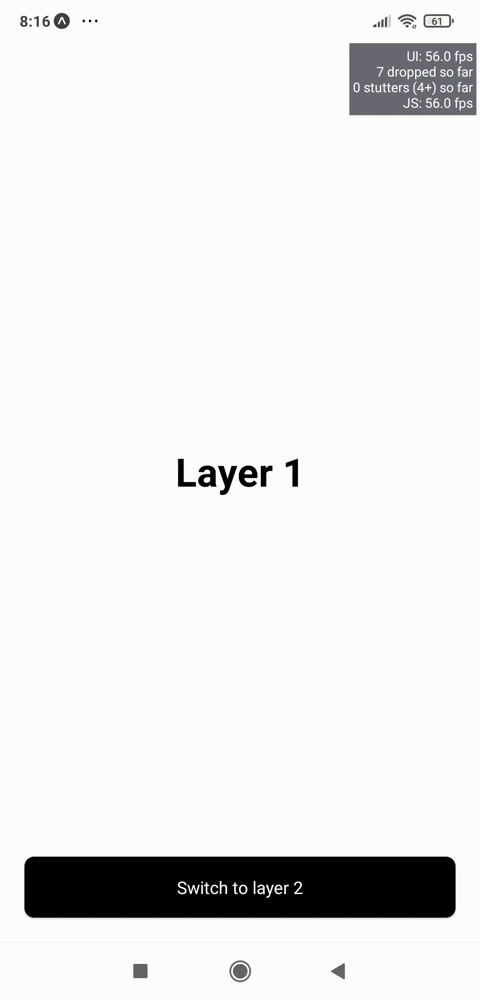

# Transition View

Make performant animated transition layers using simplified components in React-Native. 

# 1. Introduction

Make performant animated transition layers using simplified components in React-Native. The package is based on Reanimated2 allowing smooth animations.

# 2. Dependencies

- Reanimated2: https://www.reanimated2.com/docs/installation

# 3. Components

- TransitionContainer
    - container to enclose Transition Layers as children
    - height is necessary to be specified in containerStyle props 

- TransitionLayer
    - absolute positioned view
    - does not support buttons, gesture components as children. To use Buttons, set disabled to true and add onPress logic to enclosing TransitionLayer onPress prop
    - custom onPress prop to handle onPress actions
    - multiple TransitionLayer can have same layerNumber, it's placement/position needs to be handles by specifying the appropriate styles
    
- TransitionButton
    - a custom button, supported by layers
    - a simple view only button, with no onPress prop
    - onPress needs to be specified on enclosing TransitionLayer

# 4. props

- TransitionContainer
    - layers: total layers (number)
    - containerStyle: styles to apply to container

- TransitionLayer
    - layerNumber: specify the layer number, values range from 0 to layers-1 
    - switchLayerOnPress: specify the layer number to switch to on press, values range from 0 to layers-1
    - tansitionType: "fade" | "slide"
    - containerWidth: default equals to 100% relative to TransitionContainer width, values allowed in percent (%) and pixels (px)
    - containerStyle: styles to apply to container
    - onPress: specify function to execute on press

- TransitionButton
    - bgColor: background color
    - color: text color

# 5. Examples

```

import React from "react";
import { Text } from "react-native";
import {
  TransitionContainer,
  TransitionLayer,
  TransitionButton,
} from "react-native-transition-view";

export default function Demo() {
  return (
    <TransitionContainer
      layers={2}
      containerStyle={{ height: "100%", width: "100%" }}
    >
      <TransitionLayer
        layerNumber={0}
        transitionType="fade"
        containerWidth={"100%"}
        containerStyle={{
          height: "100%",
          justifyContent: "center",
          alignItems: "center",
        }}
      >
        <Text style={{ fontSize: 32, fontWeight: "bold" }}>Layer 1</Text>
      </TransitionLayer>
      <TransitionLayer
        layerNumber={0}
        switchLayerOnPress={1}
        onPress={() => console.log("switch to layer 2")}
        transitionType="slide"
        containerWidth={"100%"}
        containerStyle={{
          bottom: 0,
          left: 0,
          padding: 20,
        }}
      >
        <TransitionButton>Switch to layer 2</TransitionButton>
      </TransitionLayer>

      <TransitionLayer
        layerNumber={1}
        transitionType="fade"
        containerWidth={"100%"}
        containerStyle={{
          height: "100%",
          justifyContent: "center",
          alignItems: "center",
        }}
      >
        <Text style={{ fontSize: 32, fontWeight: "bold" }}>Layer 2</Text>
      </TransitionLayer>
      <TransitionLayer
        layerNumber={1}
        switchLayerOnPress={0}
        onPress={() => console.log("switch to layer 1")}
        transitionType="slide"
        containerWidth={"100%"}
        containerStyle={{
          bottom: 0,
          right: 0,
          padding: 20,
        }}
      >
        <TransitionButton>Switch to layer 1</TransitionButton>
      </TransitionLayer>
    </TransitionContainer>
  );
}


```

